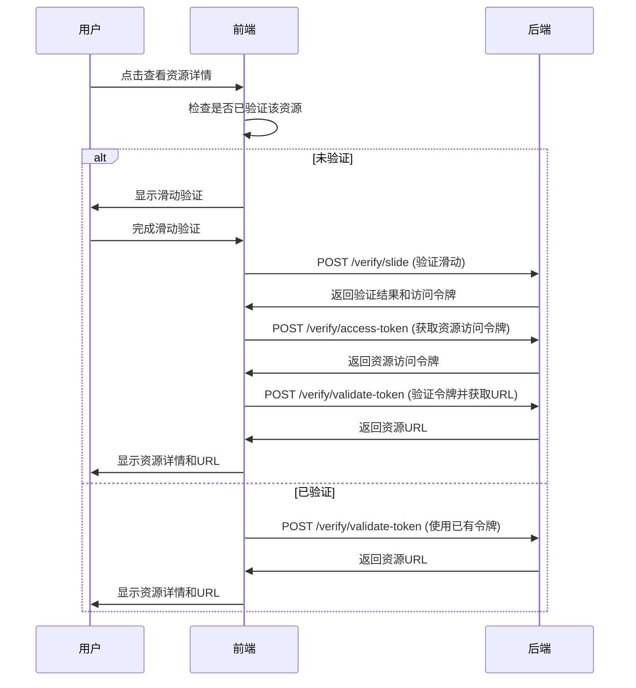

# 新的资源访问API流程

## 概述

现在接口列表不再直接返回资源的URL，而是需要通过验证流程来获取访问令牌，然后通过ID获取实际的资源URL。这提供了更好的安全性和访问控制。

## 新的API流程

### 1. 资源列表API变化

**之前**:
```json
{
  "list": [
    {
      "id": "123",
      "name": "资源名称",
      "url": "https://direct-resource-url.com", // 直接返回URL
      "type": "study"
    }
  ]
}
```

**现在**:
```json
{
  "list": [
    {
      "id": "123",
      "name": "资源名称",
      // url字段不再返回
      "type": "study"
    }
  ]
}
```

### 2. 新的访问流程



## 前端实现变化

### 1. ResourceCard组件修改

#### 新增状态管理
```javascript
// 验证状态
const verifyVisible = ref(false)
const isVerifying = ref(false)
const verifyToken = ref('')
const resourceUrl = ref('')        // 新增：动态获取的资源URL
const isLoadingUrl = ref(false)    // 新增：URL加载状态
```

#### 验证成功处理
```javascript
const handleVerifySuccess = async (verifyData) => {
  try {
    const resourceId = props.resource.id || props.resource._id

    // 1. 验证滑动结果
    const verifyResult = await verifyApi.verifySlide({
      ...verifyData,
      resourceId: resourceId
    })

    if (verifyResult.success && verifyResult.data.verified) {
      // 2. 获取资源访问令牌
      const accessResult = await verifyApi.getAccessToken({
        resourceId: resourceId,
        verifyToken: verifyResult.data.accessToken
      })

      if (accessResult.success) {
        // 3. 验证令牌并获取资源URL
        const validateResult = await verifyApi.validateAccessToken(
          accessResult.data.accessToken
        )

        if (validateResult.success && validateResult.data.valid) {
          // 保存令牌和URL
          verifyToken.value = accessResult.data.accessToken
          resourceUrl.value = validateResult.data.resourceData?.url
          
          // 标记已验证并显示详情
          globalVerifySession.markResourceVerified(resourceId)
          showResourceDetails()
        }
      }
    }
  } catch (error) {
    console.error('验证失败:', error)
  }
}
```

#### URL显示修改
```vue
<!-- 之前 -->
<el-input v-model="resource.url" readonly />

<!-- 现在 -->
<el-input 
  v-model="resourceUrl" 
  readonly 
  placeholder="验证后可获取资源链接"
  :loading="isLoadingUrl"
/>
```

### 2. API接口调用

#### verifyApi.verifySlide()
```javascript
// 验证滑动结果，获取初始访问令牌
const verifyResult = await verifyApi.verifySlide({
  challengeId: 'challenge_123',
  token: 'verify_token',
  timestamp: Date.now(),
  slidePosition: 150,
  slideTime: 1200,
  deviceFingerprint: 'device_fp',
  userAgent: 'Mozilla/5.0...',
  resourceId: 'resource_123'  // 新增：资源ID
})
```

#### verifyApi.getAccessToken()
```javascript
// 使用验证令牌获取资源访问令牌
const accessResult = await verifyApi.getAccessToken({
  resourceId: 'resource_123',
  verifyToken: 'access_token_from_verify'
})
```

#### verifyApi.validateAccessToken()
```javascript
// 验证访问令牌并获取资源URL
const validateResult = await verifyApi.validateAccessToken('resource_access_token')

// 返回数据包含实际的资源URL
console.log(validateResult.data.resourceData.url)
```

## 后端API要求

### 1. 修改现有接口

#### POST /verify/slide
**请求参数新增**:
```json
{
  "resourceId": "string"  // 新增：要访问的资源ID
}
```

#### POST /verify/access-token
**请求参数**:
```json
{
  "resourceId": "string",     // 资源ID
  "verifyToken": "string"     // 从verify/slide获取的令牌
}
```

**响应数据**:
```json
{
  "success": true,
  "data": {
    "accessToken": "string",           // 资源访问令牌
    "resourceUrl": "string",           // 可选：资源URL
    "expiresAt": 1703125456789        // 令牌过期时间
  }
}
```

#### POST /verify/validate-token
**请求参数**:
```json
{
  "token": "string"  // 资源访问令牌
}
```

**响应数据**:
```json
{
  "success": true,
  "data": {
    "valid": true,
    "resourceData": {
      "id": "string",
      "name": "string",
      "url": "string",      // 实际的资源URL
      "type": "string"
    }
  }
}
```

### 2. 资源列表接口修改

#### GET /resources/search 和 GET /resources/page

**响应数据修改**:
```json
{
  "success": true,
  "data": {
    "pageInfo": {
      "list": [
        {
          "id": "string",
          "name": "string",
          "content": "string",
          "type": "string",
          "pic": "string",
          "createTime": "string"
          // 移除 url 字段
        }
      ]
    }
  }
}
```

## 安全优势

### 1. 访问控制
- 资源URL不再直接暴露
- 需要通过验证才能获取访问权限
- 令牌有时效性，防止长期滥用

### 2. 防爬虫
- 每次访问都需要人机验证
- 令牌与设备指纹绑定
- 访问行为可追踪和审计

### 3. 资源保护
- 可以对不同资源设置不同的访问策略
- 支持访问频率限制
- 可以随时撤销访问权限

## 用户体验

### 1. 首次访问
1. 用户点击查看详情
2. 显示滑动验证
3. 验证成功后自动获取资源URL
4. 显示完整的资源信息

### 2. 后续访问
1. 用户点击查看详情
2. 检查本地验证状态
3. 如果已验证，直接显示资源信息
4. 如果令牌过期，提示重新验证

### 3. 错误处理
- 验证失败：提示重试
- 令牌过期：提示重新验证
- 网络错误：显示友好的错误信息

## 测试验证

### 1. 功能测试
- ✅ 首次访问需要验证
- ✅ 验证成功后显示资源URL
- ✅ 已验证资源可直接访问
- ✅ 令牌过期后需要重新验证

### 2. 安全测试
- ✅ 无法直接获取资源URL
- ✅ 验证令牌有时效性
- ✅ 设备指纹验证
- ✅ 防重放攻击

### 3. 用户体验测试
- ✅ 验证流程流畅
- ✅ 加载状态清晰
- ✅ 错误提示友好
- ✅ 响应速度合理

## 部署注意事项

1. **向后兼容**：确保现有客户端能够平滑过渡
2. **性能优化**：缓存验证状态，减少重复验证
3. **监控告警**：监控验证成功率和访问模式
4. **数据清理**：定期清理过期的验证令牌

这个新的API流程提供了更强的安全性，同时保持了良好的用户体验。
